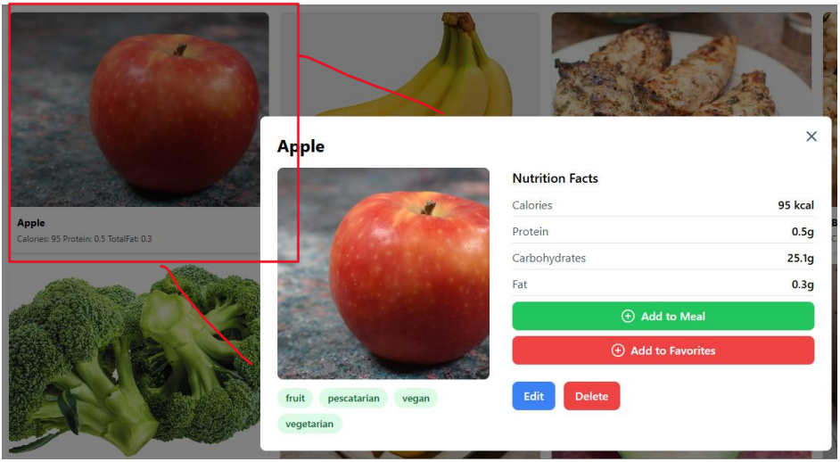
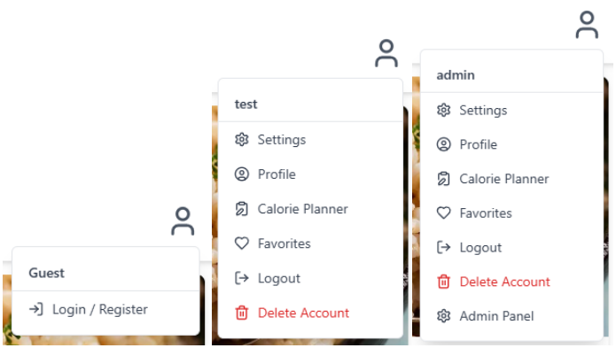

# Calories Count
_A simple calorie-counting web application to track daily calories and manage favorite foods._

---

## 📖 Description
**Calories Count** lets users log foods and track calories throughout the day. Users can create daily goals (lose, maintain, or gain weight), save favorite foods for quick re-adding, and search a foods database by tags or diet types. The app uses React + Vue for frontend, a Kotlin + Spring Boot for backend, and MySQL for database.

---

## 🚀 Features
- Add foods to the database (name, calories, tags, diet types).
- Create daily calorie goals (lose / maintain / gain).
- Save favorite foods for fast access.
- Search foods via tags, diets, or text search.

---

## 🧩 Tech Stack
- **Frontend:** React + Vue (Node.js / npm)  
- **Backend:** Kotlin + Spring Boot  
- **Database:** MySQL

---

## 🖼️ Visuals
### Example of nutritional info submenu:


### Signup page:


### Multiple profile submenus:


---

## 📘 User Manual
[User Manual](./docs/UserManual-CaloriesCount.pdf)

---

## ⚙️ Getting started

### **Pre-required Software**

- **XAMPP**
  - Download and install from [https://www.apachefriends.org/](https://www.apachefriends.org/)
  - Depending on your OS, select either the Windows, Linux, or Mac installer

- **Node.js**
  - Install from [https://nodejs.org/en/download](https://nodejs.org/en/download)
  - Depending on your OS, select from Windows, Linux, Mac, or AIX

- **IntelliJ IDEA**
  - Download from [https://www.jetbrains.com/idea/download/?section=windows](https://www.jetbrains.com/idea/download/?section=windows)
  - If you have a JetBrains subscription, use the Ultimate edition; otherwise, use the FREE Community edition

- **JDK 21**
  - Install from [https://www.oracle.com/java/technologies/downloads/#java21](https://www.oracle.com/java/technologies/downloads/#java21)
  - Select the installer for your OS

- **JDK 17**
  - Install from [https://www.oracle.com/java/technologies/javase/jdk17-archive-downloads.html](https://www.oracle.com/java/technologies/javase/jdk17-archive-downloads.html)
  - Select the installer for your OS
  - **Note:** As of now, Calories Count requires both JDK 21 & 17 to operate. This will hopefully be fixed to only require 21 in the future.

---

### **Setting up Calories Count**

- **Clone**
```bash
git clone https://github.com/your-username/calories-count.git
cd calories-count
```

- **Open Calories Count in IntelliJ**
  - In IntelliJ, select `New -> Project`
  - Navigate to where Calories Count is saved and select the folder

- **Build Gradle**
  - In IntelliJ, navigate to: `/dev/build.gradle.kts`
  - Inside `build.gradle.kts`, click the **Link** button in the top-right corner
  - Wait patiently for IntelliJ to finish linking the Gradle file (this may take some time)

- **Set up MySQL and Apache**
  - Open the **XAMPP Control Panel**
  - Start **Apache** and **MySQL**
  - Once both have started, click the **Admin** button next to MySQL

- **Start Calories Count Backend**
  - In IntelliJ, navigate to: `/dev/src/main/kotlin/com/example/test3/Test3Application.kt`
  - Run `fun main()` using the green arrow next to it, or the larger green arrow in the top-right corner of IntelliJ

- **Set up Database**
  - In PHPMyAdmin (opened from the XAMPP Control Panel), locate the `caloriescount` DB created by the backend
  - Add foods to the DB

- **Start Calories Count Frontend**
  - In IntelliJ, open the in-app terminal (Alt + F12)
  - Run one of the following commands depending on your OS:
    - Windows: `cd .\UI\`
    - Unix: `cd /UI/`
    - Alternatively: `cd ui`
  - Install NPM dependencies: `npm install`
  - Build the project: `npm run build`
  - Start the frontend: `node server.js`
  - If done properly, click the URL provided or navigate to [https://localhost:5173](https://localhost:5173) to view Calories Count


## 👥 Authors
- Cole Daniels
- Alexander Magana
- Tyler Mims
- Parker Schemm
- Caleb Shortt

## 📄 License
Copyright (c) Calories Count Team. All rights reserved.
Licensed under the [MIT](./LICENSE) license.

## 📌 Project status
This project is functional but no longer actively maintained.
If you’d like to extend it, feel free to fork.
